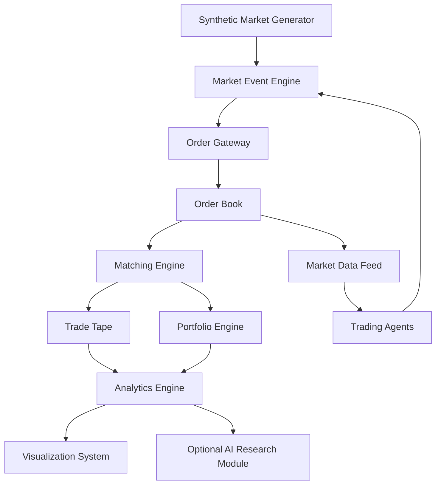
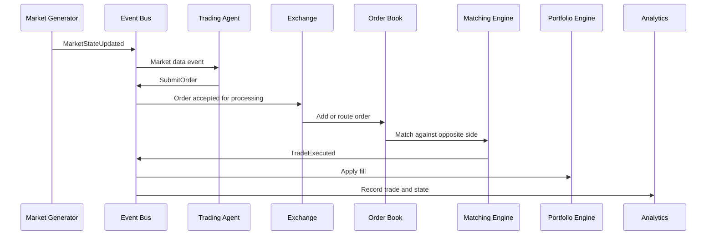

# Synthetic Market Simulator Architecture

## 1. System Goal

Build a fully event-driven synthetic financial market where autonomous trading agents submit orders into a simulated exchange. The exchange maintains an order book, matches orders deterministically, emits trades, updates portfolios, and records market data for research analytics.

The core project is not AI. The core project is the exchange engine plus event-driven market simulation. AI can be added later as one strategy or research layer.

## 2. Layered Design



## 3. Module Map

### `src/market_sim/core`

The runtime foundation of the simulator.

Responsibilities:

- Own the simulation clock.
- Own the event dispatcher.
- Own the deterministic event queue.
- Define shared base classes.
- Define shared models.
- Define runtime configuration.
- Coordinate the runtime engine.

Planned concepts:

- `core/clock`: `SimulationClock`, logical timestamps, and sequence numbering.
- `core/engine`: `RuntimeEngine`, simulation lifecycle, start/stop/replay coordination.
- `core/queue`: `EventQueue`, deterministic priority ordering, event scheduling.
- `core/models`: `SimulationConfig`, `Instrument`, `Side`, `OrderType`, `TimeInForce`, `EventType`.
- `core/config`: config loading, defaults, and run parameters.

Rule: `core/` should contain the generic simulation mechanics. Exchange rules, strategy rules, and market generation rules should live in their own modules.

### `src/market_sim/events`

The event-driven backbone.

Responsibilities:

- Define market event schemas.
- Define payload contracts.
- Keep event names and event data consistent across modules.
- Stay independent from queue mechanics.

Planned concepts:

- `Event`
- `MarketStateUpdated`
- `OrderSubmitted`
- `OrderCancelled`
- `TradeExecuted`
- `PortfolioUpdated`
- `SimulationCompleted`

### `src/market_sim/market`

Synthetic market state generation.

Responsibilities:

- Generate stochastic price ticks.
- Simulate volatility regimes.
- Emit market shocks.
- Model liquidity variation.

Planned concepts:

- `market/generators`: `PriceGenerator`, `MarketGenerator`, random walk, geometric Brownian motion.
- `market/regimes`: `VolatilityRegimeModel`, regime transitions, regime labels.
- `market/shocks`: `ShockModel`, jump events, liquidity shocks.
- `MarketState`
- `LiquidityModel`

### `src/market_sim/exchange`

The core exchange simulation.

Responsibilities:

- Accept orders and cancellations.
- Maintain bid and ask books.
- Match orders using price-time priority.
- Emit trade executions and order status updates.
- Produce order book snapshots.

Planned concepts:

- `exchange/gateway`: order intake, routing, exchange-facing API.
- `exchange/orderbook`: `OrderBook`, `PriceLevel`, bid/ask depth.
- `exchange/matching`: `MatchingEngine`, price-time priority, crossing logic.
- `exchange/execution`: `Trade`, `ExecutionReport`, fills, trade tape.
- `exchange/validation`: order validation, cancel validation, symbol/session checks.
- `Order`
- `LimitOrder`
- `MarketOrder`
- `CancelRequest`
- `Exchange`

### `src/market_sim/agents`

Autonomous trading strategies.

Responsibilities:

- Observe market data.
- Generate orders.
- React to fills and portfolio state.
- Support multiple strategy types.

Planned concepts:

- `agents/base/base_strategy.py`: common strategy interface.
- `agents/random`: baseline random trader.
- `agents/momentum`: momentum strategy.
- `agents/mean_reversion`: mean reversion strategy.
- `TradingAgent`
- `StatArbAgent`
- `VolatilityAgent`

### `src/market_sim/portfolio`

Position, cash, and risk accounting.

Responsibilities:

- Track cash, positions, realized PnL, and unrealized PnL.
- Apply fills from the matching engine.
- Produce portfolio snapshots.

Planned concepts:

- `portfolio/positions`: `Position`, position ledger, inventory state.
- `portfolio/pnl`: realized PnL, unrealized PnL, equity curve.
- `portfolio/risk`: exposure, limits, drawdown state.
- `Portfolio`
- `PortfolioManager`
- `FillProcessor`

### `src/market_sim/analytics`

Research metrics and experiment analysis.

Responsibilities:

- Calculate PnL.
- Calculate Sharpe ratio, volatility, drawdown, win/loss ratio, and tail risk.
- Compare strategy performance across regimes.
- Support Monte Carlo experiments.

Planned concepts:

- `analytics/metrics`: Sharpe, volatility, drawdown, hit rate, tail metrics.
- `analytics/statistics`: distributions, correlations, regime statistics.
- `analytics/performance`: reports, strategy comparisons, equity analysis.
- `analytics/monte_carlo`: repeated simulations and confidence intervals.
- `PerformanceReport`
- `RiskMetrics`

### `src/market_sim/visualization`

Charts and dashboards.

Responsibilities:

- Plot equity curves.
- Plot order book depth.
- Plot trade flow.
- Plot volatility and regime changes.
- Compare strategies visually.

Planned concepts:

- `EquityCurvePlot`
- `OrderBookDepthPlot`
- `TradeFlowPlot`
- `VolatilityPlot`
- `DashboardBuilder`

### `src/market_sim/ai`

Optional research layer.

Responsibilities:

- Add forecasting, anomaly detection, or reinforcement learning experiments.
- Consume historical simulation output rather than replacing the exchange core.

Planned concepts:

- `ai/forecasting`: time series forecasting experiments.
- `ai/anomaly`: anomaly detection in trades and market states.
- `ai/rl`: reinforcement learning experiments.
- `ForecastModel`
- `AnomalyDetector`
- `RLTradingAgent`

## 4. Event Flow



## 5. Data Flow

```text
1. Market generator emits synthetic market state.
2. Event engine places the market state update onto the queue.
3. Agents receive market data and decide whether to submit orders.
4. Exchange validates incoming orders.
5. Order book stores passive limit orders.
6. Matching engine executes aggressive orders using price-time priority.
7. Trades and execution reports are emitted.
8. Portfolio engine applies fills and updates positions.
9. Analytics engine records time series, PnL, risk, and trade statistics.
10. Visualization system renders charts and dashboards from stored results.
```

## 6. Core Class Boundaries

### Event Classes

```text
Event
  event_id
  event_type
  timestamp
  payload

MarketStateUpdated
OrderSubmitted
OrderCancelled
TradeExecuted
PortfolioUpdated
SimulationCompleted
```

Rule: events describe something that happened or needs to be processed. They should not own business logic.

### Exchange Classes

```text
Exchange
  receives order events
  validates orders
  sends orders to matching engine
  emits execution reports

OrderBook
  owns bid and ask price levels
  exposes best bid, best ask, depth, and snapshots
  does not decide strategy behavior

MatchingEngine
  performs deterministic matching
  applies price-time priority
  creates trades and order status updates
```

Rule: the matching engine is the most important correctness boundary. It should be deterministic, heavily tested, and independent from analytics, visualization, and AI.

### Agent Classes

```text
TradingAgent
  observes market events
  observes execution reports
  creates order intents

RandomTrader
MomentumAgent
MeanReversionAgent
```

Rule: agents should not directly mutate the exchange or portfolio. They submit events.

### Portfolio Classes

```text
Portfolio
  tracks cash
  tracks positions
  tracks realized and unrealized PnL

PortfolioManager
  receives fills
  updates portfolio state
  emits portfolio snapshots
```

Rule: portfolio accounting should depend on fills and prices, not on strategy internals.

### Analytics Classes

```text
AnalyticsRecorder
  stores trades, prices, fills, positions, and equity curve

RiskMetrics
  computes Sharpe, volatility, max drawdown, hit rate, and tail risk

ExperimentRunner
  runs repeated simulations and compares outputs
```

Rule: analytics should be downstream from the simulation. It should not alter execution.

## 7. Determinism Rules

To make this project quant-dev credible:

- Every event gets a timestamp and sequence number.
- Events with equal timestamps are processed by sequence number.
- Random number generators are seeded through `SimulationConfig`.
- Matching rules are pure and deterministic.
- Order IDs and trade IDs are generated centrally.
- Tests should assert exact execution order.

## 8. Initial Repo Structure

```text
market-sim/
├── README.md
├── pyproject.toml
├── requirements.txt
├── .gitignore
├── config/
├── docs/
│   ├── architecture/
│   │   └── ARCHITECTURE.md
│   ├── diagrams/
│   ├── research/
│   └── decisions/
├── examples/
├── notebooks/
├── src/
│   └── market_sim/
│       ├── ai/
│       │   ├── forecasting/
│       │   ├── anomaly/
│       │   └── rl/
│       ├── agents/
│       │   ├── base/
│       │   │   └── base_strategy.py
│       │   ├── random/
│       │   ├── momentum/
│       │   └── mean_reversion/
│       ├── analytics/
│       │   ├── metrics/
│       │   ├── statistics/
│       │   ├── performance/
│       │   └── monte_carlo/
│       ├── core/
│       │   ├── clock/
│       │   ├── engine/
│       │   ├── queue/
│       │   ├── models/
│       │   └── config/
│       ├── events/
│       ├── exchange/
│       │   ├── gateway/
│       │   ├── orderbook/
│       │   ├── matching/
│       │   ├── execution/
│       │   └── validation/
│       ├── market/
│       │   ├── generators/
│       │   ├── regimes/
│       │   └── shocks/
│       ├── portfolio/
│       │   ├── positions/
│       │   ├── pnl/
│       │   └── risk/
│       └── visualization/
└── tests/
    ├── exchange/
    ├── market/
    ├── agents/
    ├── integration/
    └── unit/
```

## 9. Build Phases

### Phase 0: Architecture

Goal: lock the system boundaries before writing engine code.

Deliverables:

- Repo structure.
- Architecture diagram.
- Event flow.
- Data flow.
- Class design.

### Phase 1: Exchange Core

Goal: build the deterministic order book and matching engine.

Deliverables:

- Limit orders.
- Market orders.
- Cancellations.
- Price-time priority.
- Trade and execution logs.
- Unit tests for exact matching behavior.

### Phase 2: Event Engine

Goal: make the simulation event-driven.

Deliverables:

- Event queue.
- Simulation clock.
- Event bus.
- Exchange event handlers.
- Deterministic replay.

### Phase 3: Market Generator

Goal: generate synthetic market conditions.

Deliverables:

- Random walk.
- Geometric Brownian motion.
- Volatility regimes.
- Shock events.
- Liquidity variation.

### Phase 4: Trading Agents

Goal: add autonomous participants.

Deliverables:

- Random trader.
- Momentum strategy.
- Mean reversion strategy.
- Agent order submission.
- Agent fill handling.

### Phase 5: Portfolio and Analytics

Goal: measure strategy behavior.

Deliverables:

- Portfolio accounting.
- PnL.
- Sharpe ratio.
- Max drawdown.
- Volatility.
- Win/loss ratio.
- Regime comparison.

### Phase 6: Visualization

Goal: make the project readable and impressive.

Deliverables:

- Equity curves.
- Order book depth charts.
- Trade flow charts.
- Volatility regime plots.
- Strategy comparison dashboard.

### Phase 7: Optional AI Layer

Goal: add AI only after the exchange and analytics are strong.

Deliverables:

- Forecasting experiment.
- Anomaly detection.
- Optional reinforcement learning agent.

## 10. Recommended First Implementation Order

1. Define domain models: `Order`, `Trade`, `ExecutionReport`, `Side`, `OrderType`.
2. Implement `OrderBook` with bid and ask price levels.
3. Implement `MatchingEngine` for limit orders.
4. Add market orders.
5. Add cancellation support.
6. Add deterministic unit tests.
7. Add event queue and event bus.
8. Connect agents only after the exchange core is correct.

This order keeps the hardest and most valuable part of the system at the center: the exchange.
