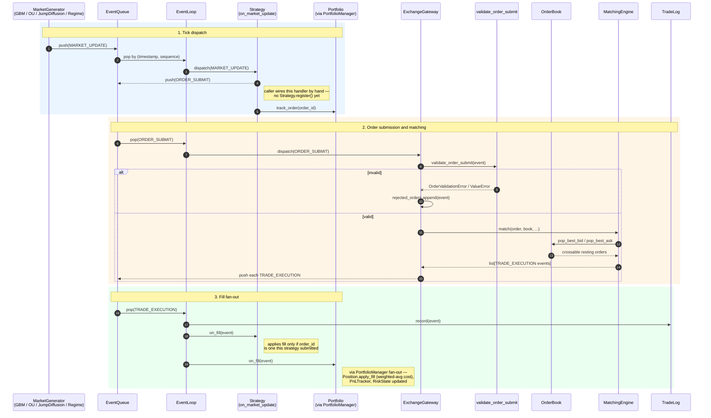

# Event Lifecycle

Traces a single order-submit-to-fill cycle through the currently implemented pipeline
(Phase 2: exchange + strategies + portfolio). `ResearchEngine`, `MonteCarloRunner`, and
`Visualization` in `ARCHITECTURE.md` §2 are Phase 3/4 and not part of this diagram.

There is no engine-level auto-wiring yet — no `Strategy.register()`, no `PortfolioManager`
auto-subscribe. `build_exchange(runtime)` is the only piece that wires itself; MARKET_UPDATE →
strategy and TRADE_EXECUTION → strategy/portfolio handlers are registered by hand at the call
site (see `tests/integration/test_portfolio_to_trade.py`). Solid arrows below are event/method
calls that happen automatically once wired; the "caller wires by hand" note marks the one place
a human still has to write glue code.

## Notes

- **Ordering is total and deterministic**: every event carries `(timestamp, sequence)`;
  `EventQueue` is a heap keyed on that pair, so replaying the same seed replays the same
  dispatch order (`ARCHITECTURE.md` §7).
- **Rejection never touches the book**: `ExchangeGateway.handle_order_submit` validates and
  constructs the `Order` before calling `MatchingEngine.match`, so a malformed order is recorded
  in `gateway.rejected_orders` and dropped — it cannot corrupt matching state for any other
  order (`ADR-002-gateway-error-boundary.md`).
- **Fan-out, not point-to-point**: `TRADE_EXECUTION` is broadcast to every registered handler
  (`TradeLog.record`, every strategy's `on_fill`, `PortfolioManager.on_fill`) — each strategy and
  each `Portfolio` self-filters by the `order_id`s it tracked at submit time. Nothing on the
  `Event` schema identifies which strategy an order belongs to.
- **Cancellation** (`ORDER_CANCEL` → `GW.handle_order_cancel` → `Book.cancel`) is a lazy-delete
  against `OrderBook._cancelled`; a cancelled resting order is skipped, not removed, the next
  time `pop_best_bid`/`pop_best_ask` walks past it.
