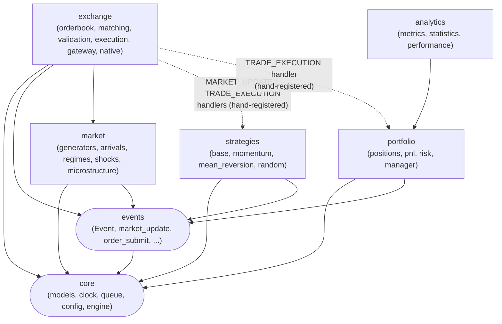

# Module Dependency Graph

Generated from actual `from market_sim...` imports in `src/market_sim` (grepped directly, not
copied from `ARCHITECTURE.md` §3's module map). `visualization/` and `ai/*` have no code yet and
are omitted; every other package named in §3 now has an implementation and is included.

### Package-level view

The shape that matters: `exchange`, `strategies`, and `portfolio` never import each other — all
three depend only on `core`/`events` (plus `exchange` also depends on `market`, see below).
Cross-group *strategy/portfolio* wiring only exists as runtime handler registration (dashed),
never as an import.

`exchange --> market` is a real import edge, not runtime wiring: `MatchingEngine`,
`ExchangeGateway`, and the native adapter/gateway all import `market.microstructure.SlippageModel`
to price market-order fills (see `ADR-004-microstructure-slippage-split.md`). This does not
violate the "exchange/strategies/portfolio never import each other" rule below — `market` isn't
one of those three peers. `analytics --> portfolio` is also a real import (`PerformanceReport`
and `compare()` read `Portfolio`/`PortfolioManager` directly), and is by design: analytics is
documented as purely downstream of portfolio state (`ARCHITECTURE.md` §3).

### Module-level detail

Same graph, one node per submodule, generated from the actual import lines grepped out of
`src/market_sim`. Layered top-to-bottom by dependency direction — every arrow points at
something the arrow's tail imports.

```mermaid
graph TD
    subgraph foundation["core + events (foundation layer)"]
        core_models["core/models<br/>(EventType, Side, OrderType)"]
        events["events<br/>(Event, market_update, ...)"]
        core_clock["core/clock<br/>(SimulationClock)"]
        core_queue["core/queue<br/>(EventQueue)"]
        core_config["core/config<br/>(SimConfig, OUConfig, RegimeConfig, ShockConfig, ...)"]
        core_engine["core/engine<br/>(EventLoop, RuntimeEngine)"]

        events --> core_models
        core_queue --> events
        core_engine --> core_models
        core_engine --> core_queue
        core_engine --> events
        core_engine --> core_clock
    end

    subgraph pkg_market["market"]
        market_gen["market/generators<br/>(PriceGenerator, OU, JumpDiffusion)"]
        market_arr["market/arrivals<br/>(PoissonArrivalProcess)"]
        market_regimes["market/regimes<br/>(VolatilityRegimeModel)"]
        market_shocks["market/shocks<br/>(ShockModel)"]
        market_micro["market/microstructure<br/>(SlippageModel)"]
    end

    subgraph pkg_exchange["exchange"]
        exch_gw["exchange/gateway<br/>(ExchangeGateway, build_exchange)"]
        exch_match["exchange/matching<br/>(MatchingEngine)"]
        exch_ob["exchange/orderbook<br/>(Order, OrderBook)"]
        exch_val["exchange/validation"]
        exch_exec["exchange/execution<br/>(TradeLog)"]
        exch_native["exchange/native<br/>(NativeOrderBook, NativeMatchingEngine,<br/>build_native_exchange)"]

        exch_gw --> exch_ob
        exch_gw --> exch_match
        exch_gw --> exch_val
        exch_gw --> exch_exec
        exch_match --> exch_ob
        exch_native --> exch_ob
        exch_native --> exch_gw
        exch_native --> exch_exec
    end

    subgraph pkg_strategies["strategies"]
        strat_base["strategies/base<br/>(Strategy ABC)"]
        strat_mom["strategies/momentum"]
        strat_mr["strategies/mean_reversion"]
        strat_rand["strategies/random"]

        strat_mom --> strat_base
        strat_mr --> strat_base
        strat_rand --> strat_base
    end

    subgraph pkg_portfolio["portfolio"]
        port_core["portfolio<br/>(Portfolio, PortfolioManager)"]
        port_pos["portfolio/positions<br/>(Position)"]
        port_pnl["portfolio/pnl<br/>(PnLTracker)"]
        port_risk["portfolio/risk<br/>(RiskState)"]

        port_core --> port_pos
        port_core --> port_pnl
        port_core --> port_risk
    end

    subgraph pkg_analytics["analytics"]
        an_metrics["analytics/metrics<br/>(sharpe, max_drawdown, calmar, ...)"]
        an_stats["analytics/statistics<br/>(correlation_matrix)"]
        an_perf["analytics/performance<br/>(PerformanceReport, compare)"]

        an_perf --> an_metrics
    end

    market_gen --> core_config
    market_gen --> core_clock
    market_gen --> events
    market_arr --> core_config
    market_regimes --> core_config
    market_regimes --> core_clock
    market_regimes --> events
    market_shocks --> core_config
    market_micro --> core_config
    market_micro --> core_models

    exch_gw --> core_clock
    exch_gw --> core_engine
    exch_gw --> core_models
    exch_gw --> core_queue
    exch_gw --> events
    exch_gw --> market_micro
    exch_match --> core_models
    exch_match --> events
    exch_match --> market_micro
    exch_ob --> core_models
    exch_val --> core_models
    exch_val --> events
    exch_exec --> core_models
    exch_exec --> events
    exch_native --> core_models
    exch_native --> events
    exch_native --> core_engine
    exch_native --> market_micro

    strat_base --> core_clock
    strat_base --> core_models
    strat_base --> events

    port_core --> core_models
    port_core --> events
    port_pos --> core_models

    an_perf --> port_core

    exch_gw -.->|"MARKET_UPDATE handler<br/>(hand-registered)"| strat_base
    strat_base -.->|"ORDER_SUBMIT pushed to queue"| exch_gw
    exch_gw -.->|"TRADE_EXECUTION handler<br/>(hand-registered)"| strat_base
    exch_gw -.->|"TRADE_EXECUTION handler<br/>(hand-registered)"| port_core
```

## Notes

- **`exchange`, `strategies`, and `portfolio` never import each other.** All three depend only
  on `core`/`events` (and `exchange` also depends on `market`, see below). The dashed edges are
  runtime wiring — `EventLoop.register_handler` calls made by the integration test / caller, not
  Python imports — confirming the "strategies never mutate the order book or portfolio directly"
  rule in `ARCHITECTURE.md` §3 actually holds in the current code, not just on paper.
- **`exchange` imports `market.microstructure`, not the rest of `market`.** `MatchingEngine`,
  `ExchangeGateway`, and the native adapter/gateway all take an optional `SlippageModel` to price
  market-order fills. `market/generators`, `market/arrivals`, `market/regimes`, and
  `market/shocks` have no consumer inside `exchange` — they're driven directly by test/notebook
  code (`notebooks/01_price_processes.ipynb`, `notebooks/02_strategy_comparison.ipynb`).
- **`market/shocks` is a leaf with no consumer anywhere yet**, deliberately — see
  `ADR-006-shock-model-placement.md`. It produces a liquidity-multiplier array; nothing in
  `src/` currently applies it. `analytics/monte_carlo` (not yet built) is the intended first
  consumer.
- **`analytics/performance` imports `portfolio` directly** — `compare()` takes a
  `PortfolioManager` and reads live `Portfolio` state. `analytics/metrics` and
  `analytics/statistics` are pure functions with no `market_sim` imports at all: they operate on
  the plain `list[tuple[timestamp, equity]]` shape `Portfolio.equity_curve` produces, not on
  `Portfolio` objects themselves.
- **`core/engine` is the only package that imports `core/clock`, `core/queue`, `core/models`,
  and `events` together** — it's the composition root (`RuntimeEngine` owns one of each), which
  is why `exchange/gateway` and `exchange/native` need to import `core/engine` directly (for
  `RuntimeEngine.next_trade_id()` / `.next_order_id()`).
- **No package imports `exchange/gateway` except `exchange/native`.** `build_native_exchange()`
  wraps `build_exchange()`'s wiring and swaps in the native `OrderBook`/`MatchingEngine` — see
  `ADR-005-native-matching-engine-boundary.md`. Outside of `exchange/native`,
  `build_exchange(runtime)` is called directly by tests and notebooks — it's an entry point, not
  a dependency of anything else in `src/`.
