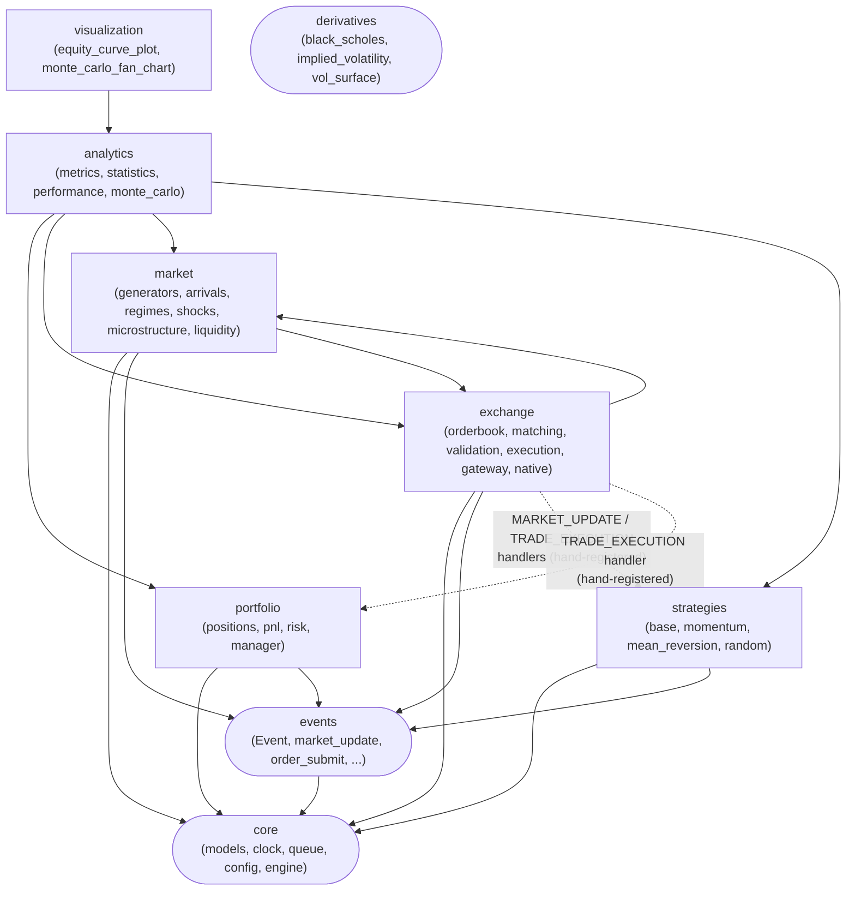

# Module Dependency Graph

Generated from actual `from market_sim...` imports in `src/market_sim` (grepped directly, not
copied from `ARCHITECTURE.md` §3's module map). `ai/*` has no code yet and is omitted; every
other package named in §3 now has an implementation and is included.

### Package-level view

The shape that matters: `exchange`, `strategies`, and `portfolio` never import each other — all
three depend only on `core`/`events` (plus `exchange` also depends on `market`, see below).
Cross-group *strategy/portfolio* wiring only exists as runtime handler registration (dashed),
never as an import.

`exchange --> market` is a real import edge, not runtime wiring: `MatchingEngine`,
`ExchangeGateway`, and the native adapter/gateway all import `market.microstructure.SlippageModel`
to price market-order fills (see `ADR-004-microstructure-slippage-split.md`). This does not
violate the "exchange/strategies/portfolio never import each other" rule below — `market` isn't
one of those three peers. `analytics --> portfolio` is also a real import (`PerformanceReport`
and `compare()` read `Portfolio`/`PortfolioManager` directly), and is by design: analytics is
documented as purely downstream of portfolio state (`ARCHITECTURE.md` §3). `analytics -->
exchange`/`market`/`strategies` are new edges from `analytics/monte_carlo.MonteCarloRunner`,
which composes a full simulation per run (`build_exchange()`, `SyntheticLiquidityProvider`,
`ShockModel`, a caller-supplied `Strategy`) — the first `analytics` submodule that drives a
simulation rather than only reading its output. See
`docs/decisions/ADR-007-liquidity-provider-placement.md`.

### Module-level detail

Same graph, one node per submodule, generated from the actual import lines grepped out of
`src/market_sim`. Layered top-to-bottom by dependency direction — every arrow points at
something the arrow's tail imports.

```mermaid
graph TD
    subgraph foundation["core + events (foundation layer)"]
        core_models["core/models<br/>(EventType, Side, OrderType)"]
        events["events<br/>(Event, market_update, ...)"]
        core_clock["core/clock<br/>(SimulationClock)"]
        core_queue["core/queue<br/>(EventQueue)"]
        core_config["core/config<br/>(SimConfig, OUConfig, RegimeConfig, ShockConfig, ...)"]
        core_engine["core/engine<br/>(EventLoop, RuntimeEngine)"]

        events --> core_models
        core_queue --> events
        core_engine --> core_models
        core_engine --> core_queue
        core_engine --> events
        core_engine --> core_clock
    end

    subgraph pkg_market["market"]
        market_gen["market/generators<br/>(PriceGenerator, OU, JumpDiffusion)"]
        market_arr["market/arrivals<br/>(PoissonArrivalProcess)"]
        market_regimes["market/regimes<br/>(VolatilityRegimeModel)"]
        market_shocks["market/shocks<br/>(ShockModel)"]
        market_micro["market/microstructure<br/>(SlippageModel)"]
        market_liq["market/liquidity<br/>(SyntheticLiquidityProvider)"]
    end

    subgraph pkg_exchange["exchange"]
        exch_gw["exchange/gateway<br/>(ExchangeGateway, build_exchange)"]
        exch_match["exchange/matching<br/>(MatchingEngine)"]
        exch_ob["exchange/orderbook<br/>(Order, OrderBook)"]
        exch_val["exchange/validation"]
        exch_exec["exchange/execution<br/>(TradeLog)"]
        exch_native["exchange/native<br/>(NativeOrderBook, NativeMatchingEngine,<br/>build_native_exchange)"]

        exch_gw --> exch_ob
        exch_gw --> exch_match
        exch_gw --> exch_val
        exch_gw --> exch_exec
        exch_match --> exch_ob
        exch_native --> exch_ob
        exch_native --> exch_gw
        exch_native --> exch_exec
    end

    subgraph pkg_strategies["strategies"]
        strat_base["strategies/base<br/>(Strategy ABC)"]
        strat_mom["strategies/momentum"]
        strat_mr["strategies/mean_reversion"]
        strat_rand["strategies/random"]

        strat_mom --> strat_base
        strat_mr --> strat_base
        strat_rand --> strat_base
    end

    subgraph pkg_portfolio["portfolio"]
        port_core["portfolio<br/>(Portfolio, PortfolioManager)"]
        port_pos["portfolio/positions<br/>(Position)"]
        port_pnl["portfolio/pnl<br/>(PnLTracker)"]
        port_risk["portfolio/risk<br/>(RiskState)"]

        port_core --> port_pos
        port_core --> port_pnl
        port_core --> port_risk
    end

    subgraph pkg_analytics["analytics"]
        an_metrics["analytics/metrics<br/>(sharpe, max_drawdown, calmar, ...)"]
        an_stats["analytics/statistics<br/>(align_equity_curves, correlation_matrix)"]
        an_perf["analytics/performance<br/>(PerformanceReport, compare)"]
        an_mc["analytics/monte_carlo<br/>(MonteCarloRunner)"]

        an_perf --> an_metrics
    end

    subgraph pkg_viz["visualization"]
        viz_equity["visualization/equity_curve_plot<br/>(plot_equity_curves)"]
        viz_fan["visualization/monte_carlo_fan_chart<br/>(plot_monte_carlo_fan_chart)"]
    end

    subgraph pkg_deriv["derivatives (isolated - no core/events dependency)"]
        deriv_bs["derivatives/black_scholes<br/>(OptionType, black_scholes_price, black_scholes_greeks)"]
        deriv_iv["derivatives/implied_volatility<br/>(implied_volatility)"]
        deriv_surf["derivatives/vol_surface<br/>(build_vol_surface)"]

        deriv_iv --> deriv_bs
        deriv_surf --> deriv_bs
        deriv_surf --> deriv_iv
    end

    market_gen --> core_config
    market_gen --> core_clock
    market_gen --> events
    market_arr --> core_config
    market_regimes --> core_config
    market_regimes --> core_clock
    market_regimes --> events
    market_shocks --> core_config
    market_micro --> core_config
    market_micro --> core_models
    market_liq --> exch_ob
    market_liq --> core_models
    market_liq --> events

    exch_gw --> core_clock
    exch_gw --> core_engine
    exch_gw --> core_models
    exch_gw --> core_queue
    exch_gw --> events
    exch_gw --> market_micro
    exch_match --> core_models
    exch_match --> events
    exch_match --> market_micro
    exch_ob --> core_models
    exch_val --> core_models
    exch_val --> events
    exch_exec --> core_models
    exch_exec --> events
    exch_native --> core_models
    exch_native --> events
    exch_native --> core_engine
    exch_native --> market_micro

    strat_base --> core_clock
    strat_base --> core_models
    strat_base --> events

    port_core --> core_models
    port_core --> events
    port_pos --> core_models

    an_perf --> port_core

    an_mc --> exch_gw
    an_mc --> market_liq
    an_mc --> market_shocks
    an_mc --> port_core
    an_mc --> strat_base

    viz_fan --> an_mc
    viz_fan --> an_stats

    exch_gw -.->|"MARKET_UPDATE handler<br/>(hand-registered)"| strat_base
    strat_base -.->|"ORDER_SUBMIT pushed to queue"| exch_gw
    exch_gw -.->|"TRADE_EXECUTION handler<br/>(hand-registered)"| strat_base
    exch_gw -.->|"TRADE_EXECUTION handler<br/>(hand-registered)"| port_core
```

## Notes

- **`exchange`, `strategies`, and `portfolio` never import each other.** All three depend only
  on `core`/`events` (and `exchange` also depends on `market`, see below). The dashed edges are
  runtime wiring — `EventLoop.register_handler` calls made by the integration test / caller, not
  Python imports — confirming the "strategies never mutate the order book or portfolio directly"
  rule in `ARCHITECTURE.md` §3 actually holds in the current code, not just on paper.
- **`exchange` imports `market.microstructure`, not the rest of `market`.** `MatchingEngine`,
  `ExchangeGateway`, and the native adapter/gateway all take an optional `SlippageModel` to price
  market-order fills. `market/generators`, `market/arrivals`, `market/regimes` have no consumer
  inside `exchange` — they're driven directly by test/notebook code
  (`notebooks/01_price_processes.ipynb`, `notebooks/02_strategy_comparison.ipynb`) or by
  `analytics/monte_carlo` (see below).
- **`market` and `exchange` now depend on each other**, in different submodules —
  `exchange/matching`+`exchange/gateway` import `market/microstructure` (`SlippageModel`), while
  `market/liquidity` imports `exchange/orderbook` (`Order`, `OrderBook`, to insert quotes
  directly). Not a circular *module* import (no submodule imports back the one that imports it),
  but a real package-level two-way edge, unlike the one-directional relationship the previous
  version of this diagram documented. See `ADR-007-liquidity-provider-placement.md` for why
  `SyntheticLiquidityProvider` inserts into `OrderBook` directly rather than through
  `ExchangeGateway`/`ORDER_SUBMIT`.
- **`market/shocks` has its first real consumer: `analytics/monte_carlo.MonteCarloRunner`.**
  `ADR-006-shock-model-placement.md` left `ShockModel` unwired and noted `MonteCarloRunner` as
  the intended first consumer once built — it now is: an optional `shock_config_factory` builds
  a per-run `ShockModel`, whose `liquidity_multiplier_path()` feeds that run's
  `SyntheticLiquidityProvider`.
- **`analytics/monte_carlo` is the first `analytics` submodule that imports `exchange`,
  `market`, and `strategies`**, not just `portfolio`. Unlike `analytics/metrics`,
  `analytics/statistics`, and `analytics/performance` (all purely downstream readers of
  `Portfolio`/equity-curve output), `MonteCarloRunner` actively composes and drives N full
  simulations (`build_exchange()` + `SyntheticLiquidityProvider` + a caller-supplied `Strategy`)
  to produce the output it then summarizes.
- **`analytics/performance` imports `portfolio` directly** — `compare()` takes a
  `PortfolioManager` and reads live `Portfolio` state. `analytics/metrics` and
  `analytics/statistics` are pure functions with no `market_sim` imports at all: they operate on
  the plain `list[tuple[timestamp, equity]]` shape `Portfolio.equity_curve` produces, not on
  `Portfolio` objects themselves.
- **`visualization` is a leaf that only depends on `analytics`, never on `exchange`/`market`/
  `strategies`/`portfolio` directly.** `plot_equity_curves` takes the plain
  `dict[strategy_id, equity_curve]` shape (no imports needed beyond matplotlib);
  `plot_monte_carlo_fan_chart` takes a `MonteCarloResult` and reuses
  `analytics.statistics.align_equity_curves` rather than re-deriving the same
  differently-sized-curves alignment logic `correlation_matrix` already solved.
- **`derivatives` is the only package with zero `core`/`events` dependency** — drawn with the
  same rounded node shape as `core`/`events` themselves to mark this visually. It's a pure
  options-pricing math library (plain floats/arrays in, plain floats/arrays out), never wired
  into the exchange/strategy/portfolio simulation loop: no options `OrderType`, no options
  position in `Portfolio`. `implied_volatility` and `vol_surface` both depend on
  `black_scholes` (for `OptionType` and the pricing formula they invert), but nothing outside
  `derivatives` depends on it yet, and nothing in `derivatives` depends on anything outside it.
  See `docs/decisions/ADR-008-derivatives-isolation-boundary.md`.
- **`core/engine` is the only package that imports `core/clock`, `core/queue`, `core/models`,
  and `events` together** — it's the composition root (`RuntimeEngine` owns one of each), which
  is why `exchange/gateway` and `exchange/native` need to import `core/engine` directly (for
  `RuntimeEngine.next_trade_id()` / `.next_order_id()`).
- **No package imports `exchange/gateway` except `exchange/native`.** `build_native_exchange()`
  wraps `build_exchange()`'s wiring and swaps in the native `OrderBook`/`MatchingEngine` — see
  `ADR-005-native-matching-engine-boundary.md`. Outside of `exchange/native`,
  `build_exchange(runtime)` is called directly by tests and notebooks — it's an entry point, not
  a dependency of anything else in `src/`.
