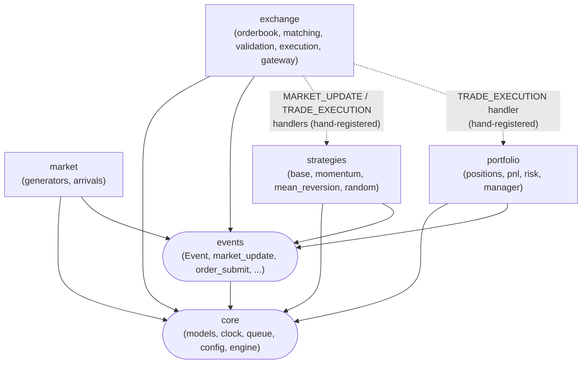

# Module Dependency Graph

Generated from actual `from market_sim...` imports in `src/market_sim` (not the aspirational
module map in `ARCHITECTURE.md` §3 — packages named there with no code yet, e.g.
`market/regimes`, `market/shocks`, `analytics/*`, `visualization/`, are omitted here).

### Package-level view

The shape that matters: everything depends on `core`/`events`, nothing in `market`, `exchange`,
`strategies`, or `portfolio` imports another one of that group at the Python level. Cross-group
arrows only exist as runtime handler wiring (dashed), never as imports.

### Module-level detail

Same graph, one node per submodule, generated from the actual import lines grepped out of
`src/market_sim`. Layered top-to-bottom by dependency direction — every arrow points at
something the arrow's tail imports.

```mermaid
graph TD
    subgraph foundation["core + events (foundation layer)"]
        core_models["core/models<br/>(EventType, Side, OrderType)"]
        events["events<br/>(Event, market_update, ...)"]
        core_clock["core/clock<br/>(SimulationClock)"]
        core_queue["core/queue<br/>(EventQueue)"]
        core_config["core/config<br/>(SimConfig, OUConfig, ...)"]
        core_engine["core/engine<br/>(EventLoop, RuntimeEngine)"]

        events --> core_models
        core_queue --> events
        core_engine --> core_models
        core_engine --> core_queue
        core_engine --> events
        core_engine --> core_clock
    end

    subgraph pkg_market["market"]
        market_gen["market/generators<br/>(PriceGenerator, OU, JumpDiffusion)"]
        market_arr["market/arrivals<br/>(PoissonArrivalProcess)"]
    end

    subgraph pkg_exchange["exchange"]
        exch_gw["exchange/gateway<br/>(ExchangeGateway, build_exchange)"]
        exch_match["exchange/matching<br/>(MatchingEngine)"]
        exch_ob["exchange/orderbook<br/>(Order, OrderBook)"]
        exch_val["exchange/validation"]
        exch_exec["exchange/execution<br/>(TradeLog)"]

        exch_gw --> exch_ob
        exch_gw --> exch_match
        exch_gw --> exch_val
        exch_gw --> exch_exec
        exch_match --> exch_ob
    end

    subgraph pkg_strategies["strategies"]
        strat_base["strategies/base<br/>(Strategy ABC)"]
        strat_mom["strategies/momentum"]
        strat_mr["strategies/mean_reversion"]
        strat_rand["strategies/random"]

        strat_mom --> strat_base
        strat_mr --> strat_base
        strat_rand --> strat_base
    end

    subgraph pkg_portfolio["portfolio"]
        port_core["portfolio<br/>(Portfolio, PortfolioManager)"]
        port_pos["portfolio/positions<br/>(Position)"]
        port_pnl["portfolio/pnl<br/>(PnLTracker)"]
        port_risk["portfolio/risk<br/>(RiskState)"]

        port_core --> port_pos
        port_core --> port_pnl
        port_core --> port_risk
    end

    market_gen --> core_config
    market_gen --> core_clock
    market_gen --> events
    market_arr --> core_config

    exch_gw --> core_clock
    exch_gw --> core_engine
    exch_gw --> core_models
    exch_gw --> core_queue
    exch_gw --> events
    exch_match --> core_models
    exch_match --> events
    exch_ob --> core_models
    exch_val --> core_models
    exch_val --> events
    exch_exec --> core_models
    exch_exec --> events

    strat_base --> core_clock
    strat_base --> core_models
    strat_base --> events

    port_core --> core_models
    port_core --> events
    port_pos --> core_models

    exch_gw -.->|"MARKET_UPDATE handler<br/>(hand-registered)"| strat_base
    strat_base -.->|"ORDER_SUBMIT pushed to queue"| exch_gw
    exch_gw -.->|"TRADE_EXECUTION handler<br/>(hand-registered)"| strat_base
    exch_gw -.->|"TRADE_EXECUTION handler<br/>(hand-registered)"| port_core
```

## Notes

- **`exchange`, `strategies`, and `portfolio` never import each other.** All three depend only
  on `core` and `events`. The dashed edges are runtime wiring — `EventLoop.register_handler`
  calls made by the integration test / caller, not Python imports — confirming the "strategies
  never mutate the order book or portfolio directly" rule in `ARCHITECTURE.md` §3 actually
  holds in the current code, not just on paper.
- **`market/generators` and `market/arrivals` are leaves consumed by nothing yet.** No other
  package imports them; they're driven directly by test/notebook code
  (`notebooks/01_price_processes.ipynb`). They'll gain a consumer once Poisson arrivals are
  wired to order content generation (currently out of scope — see
  `ADR-003-poisson-arrivals-placement.md`).
- **`core/engine` is the only package that imports `core/clock`, `core/queue`, `core/models`,
  and `events` together** — it's the composition root (`RuntimeEngine` owns one of each), which
  is why `exchange/gateway` and nothing else needs to import `core/engine` directly (it needs
  `RuntimeEngine.next_trade_id()` / `.next_order_id()`).
- **No package imports `exchange/gateway`.** `build_exchange(runtime)` is called directly by
  tests and (eventually) a runner script — it's an entry point, not a dependency of anything
  else in `src/`.
